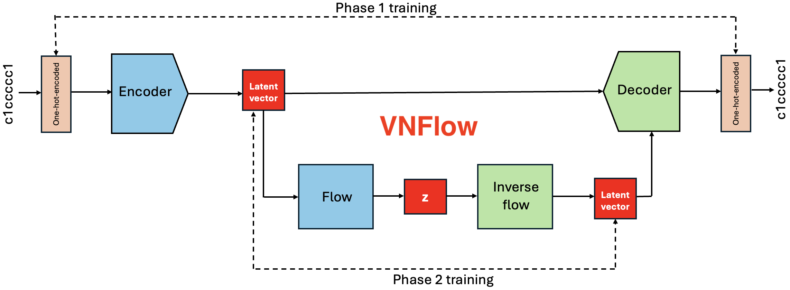

# VNFlow: Integration of Variational Autoencoders and Normalizing Flows for Novel Molecular Design

This code accompanies the first report on integrating variational autoencoders with normalizing flows into a comprehensive molecular design workflow. Our method has produced novel molecules with performance metrics exceeding those found in the ChEMBL database, underscoring its potential for identifying promising drug candidates. It is currently under review at the [Journal of Cheminformatics](https://jcheminf.biomedcentral.com). A preprint or publication link will be provided once available."

It is the result of an ongoing, multi-year collaboration between the the National Research Council Canada and Defence Research and Development Canada and was inspired by the work of Alán Aspuru-Guzik's lab ([Molecular VAE](https://github.com/aksub99/molecular-vae/tree/master)) and Nathan C. Frey ([FastFlow](https://github.com/deepchem/deepchem/blob/master/examples/tutorials/Training_a_Normalizing_Flow_on_QM9.ipynb)). Relevant portions of code from their libraries have been reused with appropriate attribution and are clearly identified within this repository.

This repository includes scripts for training and validation, analysis tools, training data, generated data, and trained models, including variational autoencoders (VAEs), normalizing flows, and their combinations.

<div align="center">
  
</div>

## Files

### Data

The `data/` folder contains the following files:

1. [zinc_vocabulary_aromatics.txt](data/zinc_vocabulary_aromatics.txt) the extracted aromatic ring fragments from the Zinc250k database, done using RDKit fragmentation tool.

2. [ChEMBL22-50k-random.zip](data/ChEMBL22-50k-random.zip) 50,000 random samples from ChEMBL22 dataset taken over from [Molecular VAE](https://github.com/aksub99/molecular-vae) github repository (if used please cite the appropriate [original work](https://chembl.blogspot.com/2016/09/chembl-22-released.html)).

3. [OP_dataset_training.csv](data/OP_dataset_training.csv) The initial dataset of 510 organo-phosphate molecules. A portion of this dataset (175 molecules with SMILES representation ending with "OP(C)(=O)F" string was used as a training dataset for one of our tests.
  
5. [OP_dataset_generated.csv](data/OP_dataset_generated.csv) The dataset of organo-phosphate molecules generated in the first organo-phosphate test.

6. `1_AutoregressiveRationalQuadraticSpline-4-32.csv, 1_MaskedAffineAutoregressive-4-32.csv, 1_RealNVP-4-32.csv, 1_RealNVP-4-32_more.csv, 1_condMaskedAffineAutoregressive-4-32.csv, 1_condRealNVP-4-32.csv, 1_random_VAE.csv` contain the datasets generated by different types of flows reported in the manuscript.

### Documents

The `documents/` folder contains the following reports:

-- the pre-print version of the manuscript will be uploaded here once available

<!-- 1. [...pdf](documents/...pdf) the pre-print version of the manuscript with details about the training, the model settings, an overview of the datasets used, and steps to reproduce our work. The report also includes the applications and findings of this work. -->

### Usage

The main tools provided by this repository are these in the folder `scripts/`:

|          Script	                      | Brief Description |
| ------------------------------------- | ------------- |
| `initial_tests_with_FastFlows.ipynb`  | workflow similar to Nathan C. Frey's FastFlows applied for organo-phosphate molecules, results not included in our report |
| `nflows_directly_and_analysis.ipynb`  | affine flows combined with reverse permutation flow and used for generation of organo-phosphate molecules |
| `OP_dataset_graphs_and_analysis.ipynb`| analysis of the generated dataset of organo-phosphate molecules |
| `ORCA_header`| settings used for DFT calculations done for organo-phosphates in the software ORCA |
| `molecules/model.py` | tools for data handling and an example of a VAE model definition |
| `molecules/dataset_loading.py` | tools for data loading for a variational autoencoder model |
| `1.0-file-prep.ipynb` | initial file conversation |
| `1.0-VAE_training.ipynb` | script for training a variational autoencoder model |
| `1.1-random_sampling_VAE.ipynb` | random sampling from a previously trained variational autoencoder model |
| `1.1-glasflow-RealNVP.ipynb` | training of flows using Glasflow library and generation of samples using a variational autoencoder model |
| `1.1-nflows.ipynb` | training of flows using nflows library and generation of samples using a variational autoencoder model |
| `1.1-normflows-MaskedRatQuad.ipynb` | training of Masked Rational Quadratic flows using normflows library and generation of samples using a variational autoencoder model |
| `1.2.analysis.ipynb` | the main analysis file for the workflow combining VAE and Flow models |

## Key Prerequisites

This project uses the following packages:

```
babel==2.14.0
flowcon==0.0.4
h5py==3.11.0
nflows==0.14
normflows==1.7.3
pandas==2.2.2
scikit-learn==1.4.2
scipy==1.13.0
selfies==2.1.1
tensorflow==2.16.1
torch==2.3.0
rdkit=2023.09.6
```

## Citing this work
If you find this repository useful in your work, please consider citing our paper.

## Support

For technical support, consider sending your question to the email of the [corresponding author](mailto:jiri.hostas@nrc-cnrc.gc.ca).

## License

Published under the MIT License (see [LICENSE](LICENSE)).

## Copyright

Centre de recherche en technologies numériques / Digital Technologies Research Centre

Conseil national de recherches Canada / National Research Council Canada

Defence Research and Development Canada / Recherche et développement pour la défense Canada

Copyright 2025, Sa Majesté le Roi du Chef du Canada / His Majesty the King in Right of Canada

---


